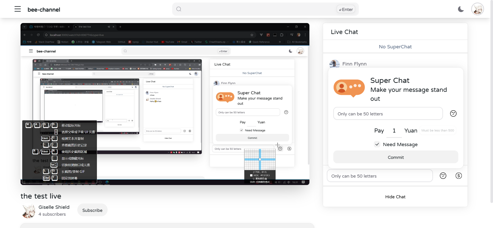
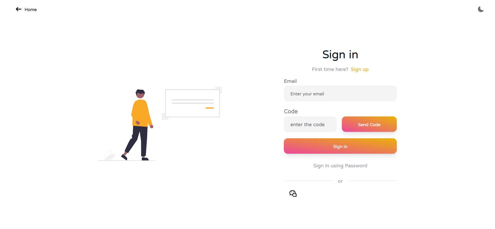

# Bee Channel

This is a video website project based on Next.js

## Technologies Used

- [Next.js 13](https://nextjs.org/docs/getting-started)
- [NextUI v2](https://nextui.org/)
- [Tailwind CSS](https://tailwindcss.com/)
- [Tailwind Variants](https://tailwind-variants.org)
- [TypeScript](https://www.typescriptlang.org/)
- [Framer Motion](https://www.framer.com/motion/)
- [next-themes](https://github.com/pacocoursey/next-themes)
- node 16.18.0

## Home Page

### Light Mode

### Dark Mode

## Some Pages Are Adaptive

  

## Video Page

## Comment Page

## Live Page

### Payment Function(Base On Alipay)

## User Related Pages

  
  
  
  
  
  

## Log In Pages

### Normal Mode

### Scan Mode(Base On WeChat)

## Sign Up Page

## License

Licensed under the [MIT license](https://github.com/nextui-org/next-app-template/blob/main/LICENSE).
